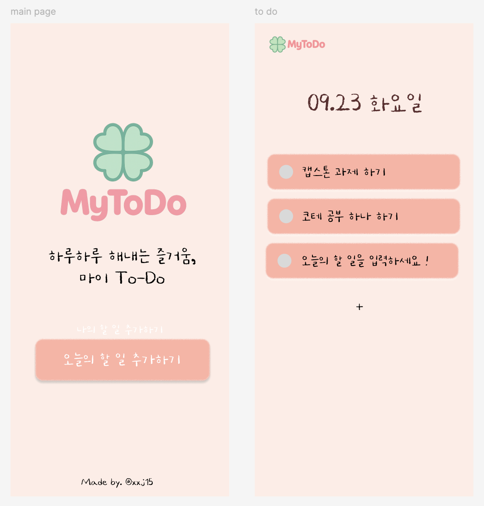
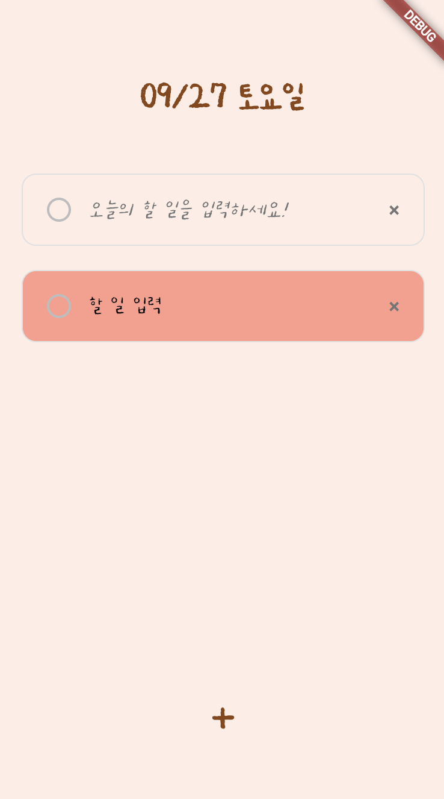
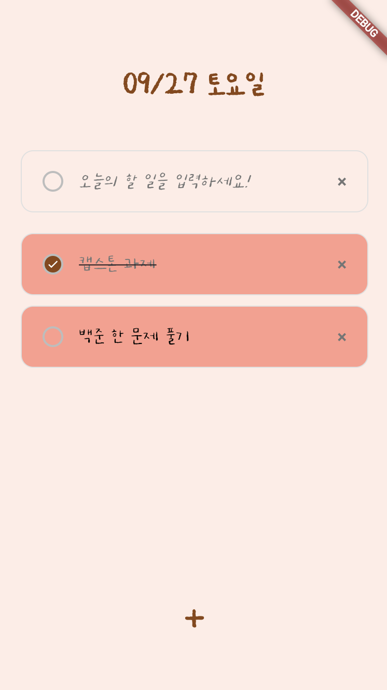
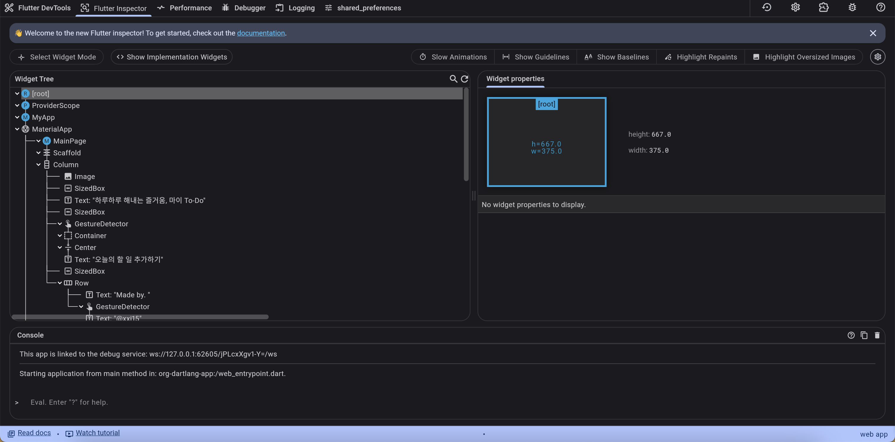
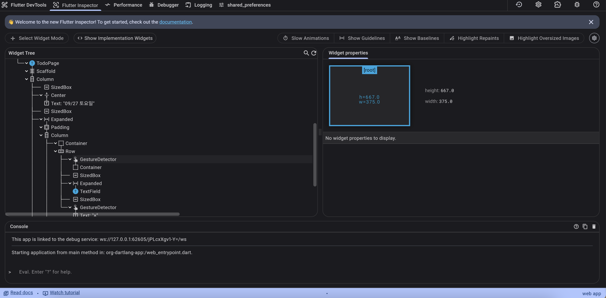
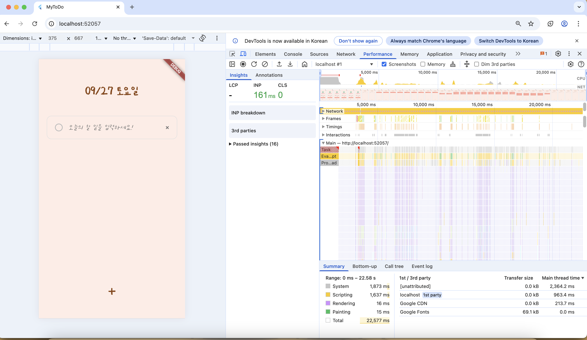
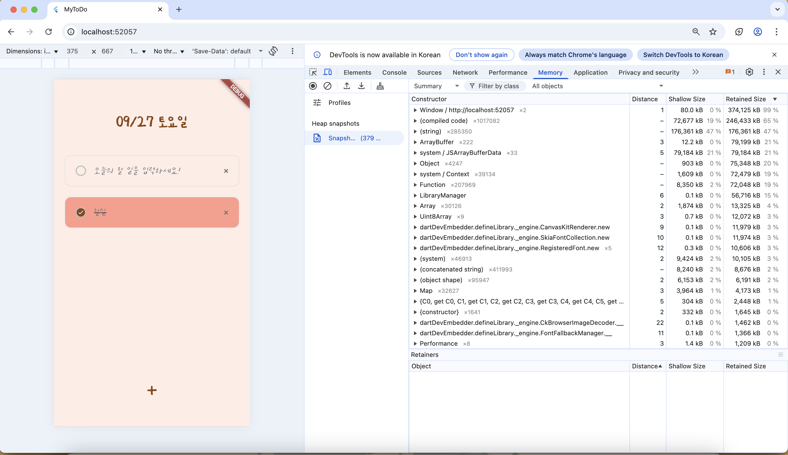

# Capstone-design-Todoapp

**CSE4103-01 커넥티드 플랫폼 이론과 실제(캡스톤 디자인)**

20200271 안서진

### 1. 피그마 디자인




피그마를 이용하여 간단하게 디자인하고 시작하였습니다.

### 2. MyToDo 실행 방법

```bash
# 프로젝트 클론 및 프로젝트 디렉토리로 이동
git clone https://github.com/xxj15/flutter_todo.git
cd flutter_todo

# 의존성 설치
flutter pub get

# 앱 실행
flutter run
```

### 3. 앱 실행 화면

| 메인페이지                                | 투두페이지 기본화면                       | 아이템 추가                                       | 체크박스 기능                                 |
| ----------------------------------------- | ----------------------------------------- | ------------------------------------------------- | --------------------------------------------- |
|  |  |  |  |

1. `오늘의 할 일 추가하기` 버튼 클릭 시 투두 화면으로 이동
2. [할 일 추가] 하단의 `+` 버튼 클릭 시 아이템 추가 가능
3. [할 일 삭제] 박스 우측의 `x` 버튼 클릭 시 아이템 삭제 가능
4. [할 일 완료 표시] 박스 좌측의 `동그라미 버튼` 클릭 시 완료 항목 체크 가능

### 4. 프로젝트 구조 및 구현

#### 📍 사용한 주요 기술

- **Flutter**, **Riverpod**, **Dart**

#### 📍 프로젝트 구조

```
flutter_todo/
├── lib/
│   ├── main.dart              # 앱 진입점
│   ├── main_page.dart         # 메인 페이지
│   ├── todo_page.dart         # 할 일 관리 페이지
│   ├── todo_model.dart        # 할 일 데이터 모델
│   └── todo_provider.dart     # 상태 관리 (Provider -> Riverpod 변경함)
├── assets/                    # 로고 이미지, 폰트 저장
└── pubspec.yaml
```

#### 📍 사용/구현한 Widget

**1. 레이아웃 위젯**

```dart
Scaffold(                    // 기본 앱 레이아웃
  body: Column(
    children: [
      Expanded(              /
        child: ListView.builder(  // 동적 목록 생성
          itemBuilder: (context, index) {
            return Container(     // 할 일 아이템 컨테이너
              child: Row(
                children: [
                  GestureDetector( // 터치 이벤트 처리
                    child: TextField( // 텍스트 입력 필드
                      controller: _textController,
                    ),
                  ),
                ],
              ),
            );
          },
        ),
      ),
    ],
  ),
)
```

**2. 상태 관리 위젯**

```dart
Consumer(
  builder: (context, ref, child) {
    final todos = ref.watch(todoProvider);
    return ListView.builder(...);
  },
)
```

#### 📍 상태 자료구조

**1. 데이터 모델**

```dart
class TodoModel {
  final String id;        // 고유 식별자
  final String text;      // 할 일 내용
  final bool isCompleted; // 완료 여부
}
```

**2. 상태 관리 클래스**

```dart
class TodoNotifier extends StateNotifier<List<TodoModel>> {
  TodoNotifier() : super([]); // 초기 상태: 빈 리스트

  // 상태 변경 메서드들
  void addTodo(String text) {
    state = [...state, TodoModel(...)]; // 불변 상태 업데이트
  }

  void deleteTodo(String id) {
    state = state.where((todo) => todo.id != id).toList();
  }
}
```

**3. Provider 정의**

```dart
final todoProvider = StateNotifierProvider<TodoNotifier, List<TodoModel>>((ref) {
  return TodoNotifier();
});
```

**4. 로컬 상태 관리**

```dart
class _TodoPageState extends ConsumerState<TodoPage> {
  final TextEditingController _textController = TextEditingController();
  bool _isInputFocused = false;
  int _checkboxState = 0;
  Map<String, bool> _todoStates = {}; // 각 할 일의 체크 상태
}
```

#### 📍 StatelessWidget vs StatefulWidget

**프로젝트에서의 사용 이유**

- **main_page.dart**: StatelessWidget 사용

  - 네비게이션만 담당, 상태 변경 없음
  - 단순히 다른 페이지로 이동하는 역할 (**읽기 전용**)

- **todo_page.dart**: StatefulWidget 사용
  - 버튼 클릭, 입력 등으로 변화 (**동적**)

#### 📍 주요 위젯 및 컴포넌트

**1. TodoModel (데이터 모델)**

```dart
class TodoModel {
  final String id;        // 고유 식별자
  final String text;      // 할 일 내용
  final bool isCompleted; // 완료 여부 (체크박스)
}
```

**2. TodoNotifier (상태 관리)**

```dart
class TodoNotifier extends StateNotifier<List<TodoModel>> {
  // 할 일 추가, 삭제, 완료 토글 기능
  void addTodo(String text);
  void addTodoWithStatus(String text, bool isCompleted);
  void deleteTodo(String id);
  void toggleTodo(String id);
}
```

**3. 주요 UI 위젯**

- `Scaffold`: 기본 앱 레이아웃
- `ListView.builder`: 동적 할 일 목록
- `TextField`: 할 일 입력 필드
- `GestureDetector`: 체크박스, 삭제 버튼 터치 이벤트
- `Consumer`: Riverpod 상태 감시 위젯

### 5. DevTools 분석

#### DevTools 실행 방법

```bash
# 앱 실행 후 DevTools 열기
flutter run
# 새 터미널에서
flutter pub global activate devtools
flutter pub global run devtools
```

#### DevTools 화면 분석

| Flutter Inspector                                                                                                            | Performance                                   | Memory                              |
| ---------------------------------------------------------------------------------------------------------------------------- | --------------------------------------------- | ----------------------------------- |
| <br> |  |  |
